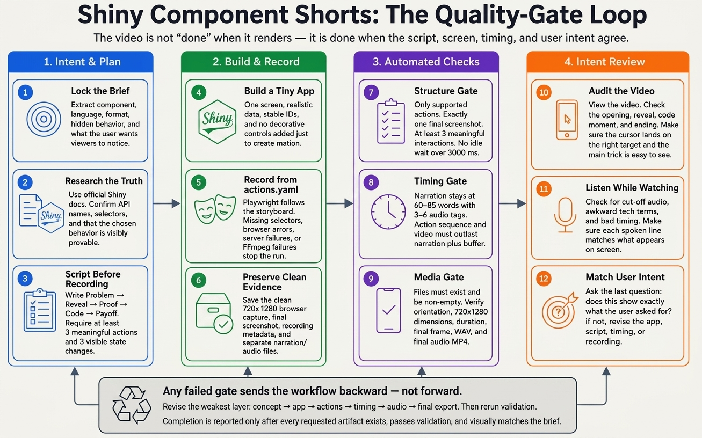

# Shiny Component Shorts

Generate 30-second videos about Shiny components. One video = one useful, surprising behavior — not a tutorial.

## Example finished short

https://github.com/user-attachments/assets/af6b0ec9-b78a-4f4b-a849-ad896d4500e6

## How it works




## What you can create

- Short Shiny mini-apps (Python or R)
- 30-second video storyboards and narration scripts
- Automated browser recordings with a VS Code-style code card
- Narrated, finished vertical videos
- Videos about an **existing** Shiny app, without modifying it

## Setup

```bash
python -m pip install -r requirements.txt
python -m playwright install chromium
```

You also need `ffmpeg` and `ffprobe` on `PATH`.

For narrated videos (optional — not needed for silent videos):

```bash
python3 -m pip install google-genai
export GEMINI_API_KEY="your-key"   # GOOGLE_API_KEY also works; never commit either
```

## Usage

Everything is prompt-driven — the agent runs the recording, TTS, and validation scripts for you. The same skill ships in `.claude/` (Claude Code) and `.agents/` (Antigravity, Codex, OpenCode).

### Claude Code

```text
/shiny-component-shorts toolbar-select in Python
/shiny-component-shorts Create 5 did-you-know video ideas for Shiny data grid. Include runnable mini apps.
```

### Google Antigravity

Open the repo root as the workspace, then:

```text
Use the shiny-component-shorts skill to create a narrated vertical video about Shiny's date range selector in Python.
```

### Codex

```text
Use $shiny-component-shorts to create 5 mini-app video ideas for Shiny toolbar-select in Python.
```

### OpenCode

Disable Claude-compatible skill discovery so only the `.agents` copy loads:

```bash
OPENCODE_DISABLE_CLAUDE_CODE_SKILLS=1 opencode
```

```text
Use the shiny-component-shorts skill to create a multi-video series for Shiny data grid in Python.
```

### Multi-video series

Ask for multiple videos about one component and the skill uses its series workflow:

- At most **5 videos per component**, each proving a distinct hidden behavior
- Fewer ideas are returned when the component lacks enough strong, visual behaviors
- One lead agent locks the research and series direction; up to three subagents build videos in isolated directories
- TTS, recording, audio merging, and validation run through a cached, timing-safe batch processor

## Video format

Every recording must:

- Use at least **3 meaningful interactions** and **3 visible state changes**
- Reveal, contrast, and replay or reset the same hidden behavior — no long idle waits or static code cards
- Default to a true 9:16 vertical composition with the app as the hero
- Reserve the top and bottom 20% of the frame for later branding
- Use the official Shiny palette (`#007BC2` blue, `#1D1F21` text on light, `#FFFFFF` text on dark)

The storyboard follows `Problem → Reveal → Proof → Code → Payoff`, but those labels never appear on screen — the browser recording stays clean.

The code card is a syntax-highlighted VS Code-style editor showing a verbatim slice of the app source: dimmed `before`/`after` context around one animated, highlighted decisive line, with honest gutter numbers. In vertical videos it renders in the lower half of the frame, below the component; in horizontal videos the app and code sit side by side.

Narration is speech only — laughing, giggling, and other non-speech sounds are rejected by validation. Detailed pacing rules live in each skill's `references/` directory.

## Narration options

Just describe what you want in the prompt:

- **Generated narration** (default when you ask for audio) — the agent writes the script and synthesizes it with Gemini 3.1 Flash TTS Preview, then times every on-screen action to the measured audio.
- **Reuse existing narration** — point the agent at a WAV or an already-narrated video and it uses that audio instead of calling TTS. No API key needed.
- **Silent videos** — a narration script is still written (it drives action timing), but no TTS is called and no API key is required.
- **Pin a voice or model** — add a per-video `tts-settings.json` with `{"voice": "Kore"}` and the agent uses it for that video.

For narrated videos, the agent generates the audio first, measures it, and only records after the action timing is reviewed against the real narration — so reactions land on the sentences that describe them. Audio is merged with two-pass loudness normalization to the -14 LUFS short-form target.

## Cost reporting

- `artifacts/narration.usage.json` records exact Gemini token usage and a paid-tier list-price estimate
- Imported or silent narration reports `$0` TTS cost
- Each artifact-generating workflow ends with a cost report; subscription usage, unavailable usage, and list-price estimates are labeled separately so a partial estimate is never presented as a complete bill
