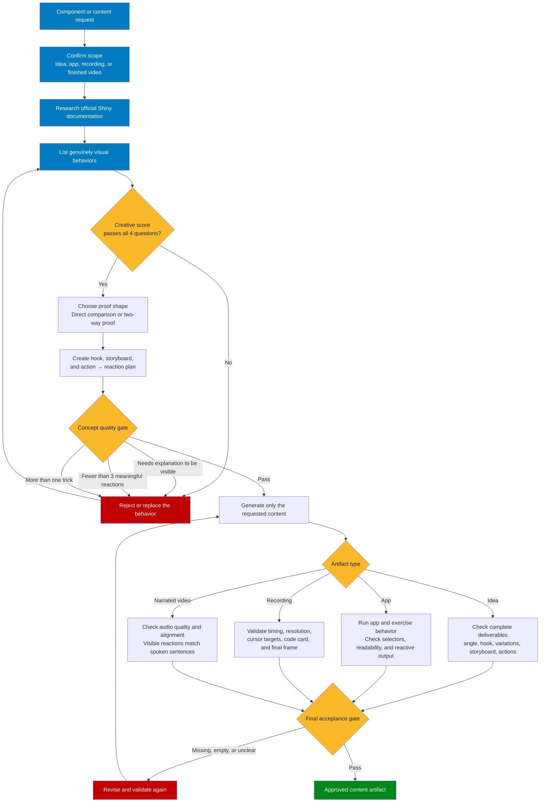

# Shiny Component Shorts

Generate 30-second videos about Shiny components. One video = one useful, surprising behavior — not a tutorial.

## Example finished short

https://github.com/user-attachments/assets/af6b0ec9-b78a-4f4b-a849-ad896d4500e6

https://github.com/user-attachments/assets/79519994-e8be-4450-91f2-549f5765c4fa

### using a PR as a reference

[PR](https://github.com/posit-dev/shinychat/pull/269)

https://github.com/user-attachments/assets/a3459a49-3647-4136-b171-1801008269f1

## How it works


```mermaid
flowchart TD
    A["User request"] --> B["Scope only the requested output"]
    B --> C["Read the required references"]
    C --> D["Research official Shiny documentation"]
    D --> E["List genuinely visual behaviors"]

    E --> F{"Does the behavior pass<br/>all creative checks?"}
    F -- "No" --> R1["Reject or refine candidate"]
    R1 --> E
    F -- "Yes" --> G["Choose one hidden behavior"]

    G --> H{"Proof shape"}
    H --> H1["Direct comparison"]
    H --> H2["Two-way proof"]
    H1 --> I
    H2 --> I

    I["Create the idea package<br/>Angle · Hook · Mini-app · Variations<br/>Storyboard · Action → reaction plan"]

    I --> J{"Multi-video series?"}
    J -- "Yes" --> K["Score up to five distinct behaviors"]
    K --> L["Order strongest first<br/>Assign visual and performance directions"]
    L --> M["Use one directory per selected video"]
    M --> N

    J -- "No" --> N{"Requested deliverable?"}

    N -- "Idea only" --> O["Return complete idea package<br/>Create no files or media"]

    N -- "Runnable app" --> P["Build minimal app.py or app.R"]
    P --> P1["Use realistic data and stable selectors"]
    P1 --> P2["Run app and exercise the behavior"]

    N -- "Existing app" --> Q["Inspect source, dependencies, and run instructions"]
    Q --> Q1["Run and inspect the original app unchanged"]
    Q1 --> Q2{"Is one behavior<br/>visually provable?"}
    Q2 -- "No" --> Q3["Report strongest near-misses<br/>Do not manufacture interactions"]
    Q2 -- "Yes" --> Q4["Keep original app as recording subject<br/>Create a sidecar production directory"]

    N -- "Silent recording" --> S["Write storyboard and actions.yaml"]
    Q4 --> S
    P2 --> S
    S --> S1["Write narration envelope<br/>Timing target only—no paid TTS"]
    S1 --> S2["Run shared record_demo.py"]
    S2 --> S3["Run validate_demo.py"]

    N -- "Narrated or finished video" --> T["Write narration envelope and transcript"]
    Q4 --> T
    P2 --> T
    T --> T1{"Narration source?"}
    T1 -- "Generate TTS" --> T2["Generate and listen to narration.wav"]
    T1 -- "Existing audio" --> T3["Import audio and match transcript"]
    T2 --> T4
    T3 --> T4

    T4["Measure duration and sentence boundaries"]
    T4 --> T5["Align actions.yaml to measured speech"]
    T5 --> T6{"Multiple videos?"}

    T6 -- "No" --> T7["Record and validate with --require-audio"]
    T7 --> T8["Merge using merge_audio.py"]

    T6 -- "Yes" --> U["Batch narration phase"]
    U --> U1["Listen and inspect timing reports"]
    U1 --> U2["Adjust actions.yaml"]
    U2 --> U3["Approve exact timing inputs"]
    U3 --> U4["Batch record · merge · validate"]

    O --> V
    P2 --> V
    S3 --> V
    T8 --> V
    U4 --> V
    Q3 --> Z

    V{"Verification gate"}

    V --> V1["Requested outputs exist and are non-empty"]
    V1 --> V2["Behavior and selectors work"]
    V2 --> V3["Validate resolution, cursor, timing, and media"]
    V3 --> V4["Inspect first, reveal, code, and final frames"]
    V4 --> V5["For audio: listen while watching"]

    V5 --> W{"Every check passes?"}
    W -- "No" --> X["Revise the weakest layer<br/>Concept · App · Actions · Timing · Audio"]
    X --> N
    W -- "Yes" --> Z["Report verified deliverables"]

    CS["Changeset entry (PR · commit · SHA)<br/>Resolve with gh · read the changelog entry first<br/>Pick one user-facing change · install that build"]
    CS -. "Alternate research path" .-> E

    GC["Global production constraints<br/>One trick · 3 meaningful reactions · 9:16 default<br/>Middle 60% app band · Shiny palette · Phone-readable"]
    GC -. "Applies throughout" .-> I
    GC -.-> P
    GC -.-> S
    GC -.-> T

    classDef process fill:#007BC2,color:#FFFFFF,stroke:#005F96,stroke-width:2px;
    classDef decision fill:#F9B928,color:#1D1F21,stroke:#9A6A00,stroke-width:2px;
    classDef reject fill:#C10000,color:#FFFFFF,stroke:#830000,stroke-width:2px;
    classDef success fill:#00891A,color:#FFFFFF,stroke:#005D12,stroke-width:2px;
    classDef note fill:#F8F8F8,color:#1D1F21,stroke:#CDD4DA,stroke-width:2px;

    class A,B,C,D,E,G,I,K,L,M,O,P,P1,P2,Q,Q1,Q4,S,S1,S2,S3,T,T1,T2,T3,T4,T5,T7,T8,U,U1,U2,U3,U4,V1,V2,V3,V4,V5 process;
    class F,H,J,N,Q2,T6,V,W decision;
    class R1,Q3,X reject;
    class Z success;
    class CS,GC,H1,H2 note;
```

## Quality control


```mermaid
flowchart TD
    A["Component or content request"] --> B["Confirm scope<br/>Idea, app, recording, or finished video"]
    B --> C["Research official Shiny documentation"]
    C --> D["List genuinely visual behaviors"]

    D --> E{"Creative score<br/>passes all 4 questions?"}
    E -- "No" --> F["Reject or replace the behavior"]
    F --> D
    E -- "Yes" --> G["Choose proof shape<br/>Direct comparison or two-way proof"]

    G --> H["Create hook, storyboard,<br/>and action → reaction plan"]
    H --> I{"Concept quality gate"}

    I -- "Needs explanation to be visible" --> F
    I -- "Fewer than 3 meaningful reactions" --> F
    I -- "More than one trick" --> F
    I -- "Pass" --> J["Generate only the requested content"]

    J --> K{"Artifact type"}

    K -- "Idea" --> L["Check complete deliverables<br/>angle, hook, variations, storyboard, actions"]
    K -- "App" --> M["Run app and exercise behavior<br/>Check selectors, readability, and reactive output"]
    K -- "Recording" --> N["Validate timing, resolution,<br/>cursor targets, code card, and final frame"]
    K -- "Narrated video" --> O["Check audio quality and alignment<br/>Visible reactions match spoken sentences"]

    L --> P{"Final acceptance gate"}
    M --> P
    N --> P
    O --> P

    P -- "Missing, empty, or unclear" --> Q["Revise and validate again"]
    Q --> J
    P -- "Pass" --> R["Approved content artifact"]

    style A fill:#007BC2,color:#FFFFFF
    style B fill:#007BC2,color:#FFFFFF
    style C fill:#007BC2,color:#FFFFFF
    style D fill:#007BC2,color:#FFFFFF
    style E fill:#F9B928,color:#1D1F21
    style I fill:#F9B928,color:#1D1F21
    style K fill:#F9B928,color:#1D1F21
    style P fill:#F9B928,color:#1D1F21
    style F fill:#C10000,color:#FFFFFF
    style Q fill:#C10000,color:#FFFFFF
    style R fill:#00891A,color:#FFFFFF
```

### Legend

- **Blue** `#007BC2` — normal production steps
- **Yellow** `#F9B928` — decision gates
- **Red** `#C10000` — rejection and revision loops
- **Green** `#00891A` — approved output

## What you can create

- Short Shiny mini-apps (Python or R), including [shinychat](https://github.com/posit-dev/shinychat) chat apps
- 30-second video storyboards and narration scripts
- Automated browser recordings with a VS Code-style code card
- Narrated, finished vertical videos
- Videos about an **existing** Shiny app, without modifying it
- Videos about a **pull request, commit, or SHA** — one user-facing change from the diff

## Setup

```bash
python -m pip install -r requirements.txt
python -m playwright install chromium
```

You also need `ffmpeg` and `ffprobe` on `PATH`.

`shinychat` is not listed separately because Shiny for Python already depends on it. A few shinychat features — conversation history, message editing, sibling navigation — additionally require a client object, so those demos need `pip install chatlas` in the demo's own environment. It stays out of `requirements.txt` on purpose: it pulls an LLM SDK stack that the other demos never use, and the demos that do use it drive a canned offline client, never a real model.

For narrated videos (optional — not needed for silent videos):

```bash
python3 -m pip install google-genai
export GEMINI_API_KEY="your-key"   # GOOGLE_API_KEY also works; never commit either
```

## Usage

Everything is prompt-driven — the agent runs the recording, TTS, and validation scripts for you. The same skill ships in `.claude/` (Claude Code) and `.agents/` (Antigravity, Codex, OpenCode).

### Claude Code

```text
/shiny-component-shorts toolbar-select in Python
/shiny-component-shorts Create 5 did-you-know video ideas for Shiny data grid. Include runnable mini apps.
```

### Google Antigravity

Open the repo root as the workspace, then:

```text
Use the /shiny-component-shorts skill to create a narrated vertical video about Shiny's date range selector in Python.
```

### Codex

```text
Use /shiny-component-shorts to create 5 mini-app video ideas for Shiny toolbar-select in Python.
```

### OpenCode

Disable Claude-compatible skill discovery so only the `.agents` copy loads:

```bash
OPENCODE_DISABLE_CLAUDE_CODE_SKILLS=1 opencode
```

```text
Use the shiny-component-shorts skill to create a multi-video series for Shiny data grid in Python.
```

### From a pull request, commit, or SHA

Point the skill at a change instead of a component and it finds the one behavior in that diff worth 30 seconds:

```text
/shiny-component-shorts Make a video about https://github.com/posit-dev/py-shiny/pull/2051
/shiny-component-shorts Make a vertical video about posit-dev/shinychat#221 in R
/shiny-component-shorts What's demo-worthy in rstudio/shiny commit a1b2c3d?
```

It works for `rstudio/shiny`, `posit-dev/py-shiny`, and `posit-dev/shinychat` (both `pkg-py/` and `pkg-r/`). The agent resolves the ref with `gh`, reads the changelog entry before the code, ranks the public API surface above docs, tests, typing, and CI, and installs that exact build into a throwaway environment so the demo runs against the changed code rather than the released package. Unreleased changes are described as just landed, never as a version number that has not shipped. If the changeset is an internal refactor with nothing visible, the agent says so instead of manufacturing a demo.

shinychat demos never call a real LLM — canned replies and canned streams keep recordings repeatable and key-free.

### Multi-video series

Ask for multiple videos about one component and the skill uses its series workflow:

- At most **5 videos per component**, each proving a distinct hidden behavior
- Fewer ideas are returned when the component lacks enough strong, visual behaviors
- One lead agent locks the research and series direction; up to three subagents build videos in isolated directories
- TTS, recording, audio merging, and validation run through a cached, timing-safe batch processor

## Video format

Every recording must:

- Use at least **3 meaningful interactions** and **3 visible state changes**
- Reveal, contrast, and replay or reset the same hidden behavior — no long idle waits or static code cards
- Default to a true 9:16 vertical composition with the app as the hero
- Reserve the top and bottom 20% of the frame for branding
- Carry the Shiny wordmark, which the recorder stamps into the top-left of every frame at phone-legible size, flipping to white where a dark backdrop would swallow it
- Use the official Shiny palette (`#007BC2` blue, `#1D1F21` text on light, `#FFFFFF` text on dark)

The storyboard follows `Problem → Reveal → Proof → Code → Payoff`, but those labels never appear on screen — the browser recording stays clean.

During the code beat, a syntax-highlighted code card styled like a real VS Code window shows real source context: a verbatim slice of the app with dimmed `before`/`after` lines around one animated, highlighted decisive line, and honest gutter numbers. In vertical videos it renders in the lower half of the frame, below the component; in horizontal videos the app and code sit side by side.

Narration is speech only — laughing, giggling, and other non-speech sounds are rejected by validation. Detailed pacing rules live in each skill's `references/` directory.

## Fast, cheap iteration

A full take is a browser run, an encode, a validation, and a frame review, so the pipeline front-loads the cheap checks:

- **Preflight** — `record_demo.py --dry-run` starts the app, resolves every selector, scans for a **Shiny Client Errors** panel, and screenshots the composition without recording. Missing selectors surface in seconds instead of after a full take.
- **Review sheet** — `review_frames.py` tiles the first, reveal, code, and final frames into one `artifacts/review.png` at phone width, which is the size the video is actually judged at.
- **Validation summary** — the validator prints a short summary, including which narration sentence each visible action lands in, and writes the full report to `artifacts/validation.json`.

The skill also asks the agent to keep one video per session and to run the record → inspect → fix loop in a subagent, so a long production run does not keep re-reading its own history.

## Narration options

Just describe what you want in the prompt:

- **Generated narration** (default when you ask for audio) — the agent writes the script and synthesizes it with Gemini 3.1 Flash TTS Preview, then times every on-screen action to the measured audio.
- **Reuse existing narration** — point the agent at a WAV or an already-narrated video and it uses that audio instead of calling TTS. No API key needed.

  ```text
  /shiny-component-shorts Create a vertical video about bslib value boxes in R.
  Use the narration from recordings/value-box-take2.wav instead of generating new audio.
  ```

  ```text
  Use the shiny-component-shorts skill to remake the slider demo video, reusing the
  narration audio from old-videos/slider-final.mp4.
  ```

- **Silent videos** — a narration script is still written (it drives action timing), but no TTS is called and no API key is required.

  ```text
  /shiny-component-shorts Create a vertical video about Shiny's date range picker
  in Python, with a narration script but no audio — I'll record the voiceover myself.
  ```

- **Pin a voice or model** — add a per-video `tts-settings.json` with `{"voice": "Kore"}` and the agent uses it for that video.

For narrated videos, the agent generates the audio first, measures it, and only records after the action timing is reviewed against the real narration — so reactions land on the sentences that describe them. Audio is merged with two-pass loudness normalization to the -14 LUFS short-form target.

## Cost reporting

- `artifacts/narration.usage.json` records exact Gemini token usage and a paid-tier list-price estimate
- Imported or silent narration reports `$0` TTS cost
- Each artifact-generating workflow ends with a cost report; subscription usage, unavailable usage, and list-price estimates are labeled separately so a partial estimate is never presented as a complete bill
